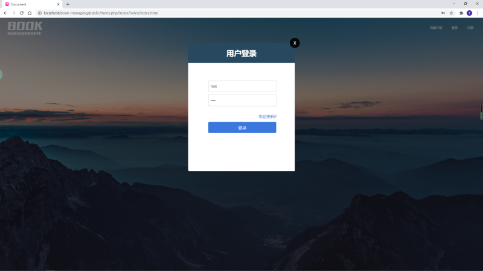
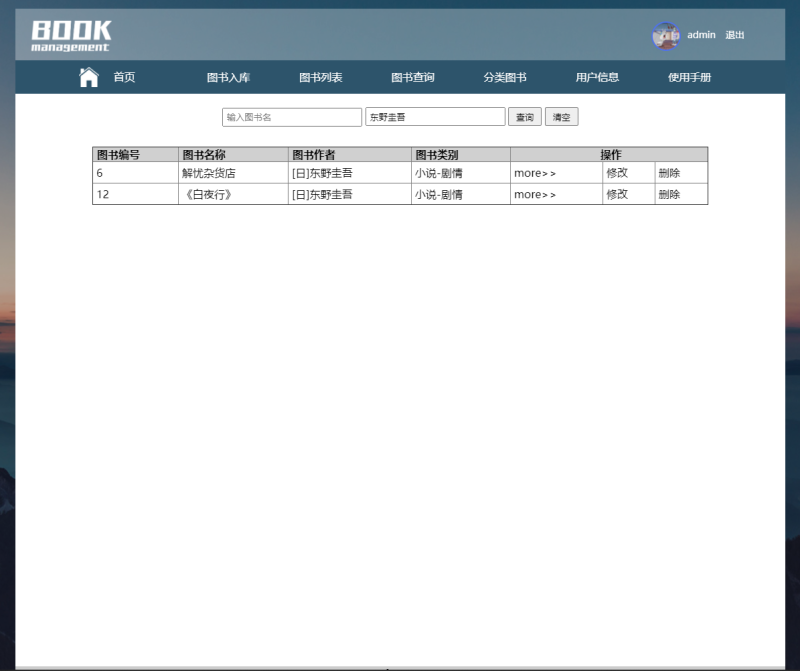

## 1. 网站主题

图书管理系统

## 2. 主页URL

http://localhost/book-managing/public

## 3. 数据库名称

library

## 4. 数据库用户名

root

## 5. 数据库密码

root

## 6. 功能简介

1. **首页**

   

   

2. **登录&注册**

   > 用户名：**admin**
   >
   > 密   码：**123456**

   

   

   

   

   
   
   
   
3. **安装说明**
   
